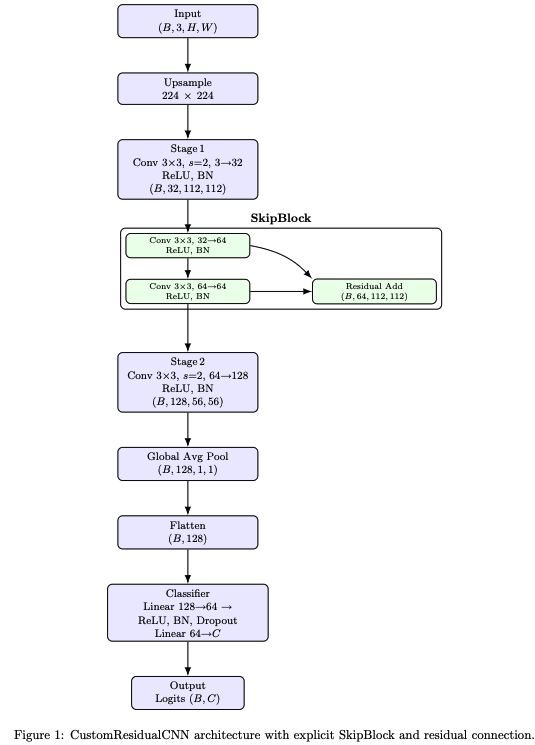

# Lung Disease Classification

## Overview
This repository hosts a deep learning project dedicated to classifying lung diseases from chest X-ray images. The goal is to categorize images into **eight distinct lung condition classes** using various Convolutional Neural Network (CNN) architectures. The project implements **transfer learning** with pre-trained models (ResNet50, MobileNetV3-Small) and features a **custom-designed residual network** for comparative analysis.

---

## Key Features
* **Multiple Architectures:** Implementation of three distinct CNN models for training and evaluation.
* **Transfer Learning:** Utilizes models pre-trained on the **ImageNet dataset** (`IMAGENET1K_V1`) to leverage learned features, improving performance and convergence speed (ResNet50, MobileNetV3-Small).
* **Custom Residual Network:** Features a unique `CustomResidualCNN` built with `SkipBlock`s and **Global Average Pooling (GAP)** for efficient feature extraction and classification.
* **Mixed Precision Training:** Configured to use **Automatic Mixed Precision (AMP)** (`use_amp = True`) to speed up computation and reduce memory usage during training.
* **Experiment Tracking:** Uses **Weights & Biases (wandb)** for robust experiment monitoring, logging, and visualization.
* **Core Framework:** Built entirely on **PyTorch** and **Torchvision**.

---

## Dataset Details
The project is configured to use the **Lung X-Ray Image Clinical Text Dataset** from Kaggle.

| Parameter | Value | Source |
| :--- | :--- | :--- |
| **Data URL** | `https://www.kaggle.com/api/v1/datasets/download/ghostbat101/lung-x-ray-image-clinical-text-dataset` | `config.py` |
| **Local Path** | `/content/dataset/Main dataset` | `config.py` |
| **Image Size** | **224x224** pixels | `config.py` |
| **Number of Classes** | **8** | `config.py` |

### Classification Classes
The model is trained to classify images into the following 8 classes:

1.  Degenerative Infectious Diseases
2.  Encapsulated Lesions
3.  Obstructive Pulmonary Diseases
4.  Higher Density
5.  Mediastinal Changes
6.  Normal
7.  Lower Density
8.  Chest Changes

---

## Model Architectures (`models.py`)

### 1. PreTrained Models (Transfer Learning)
Both pre-trained models are based on the **IMAGENET1K_V1** weights.

* **ResNet50:** The final fully connected layer (`model.fc`) is replaced with a new `nn.Linear` layer to match the **8-class** output.
* **MobileNetV3Small:** The last layer of the classifier head (`model.classifier[3]`) is replaced with a new `nn.Linear` layer for the **8-class** output.

### 2. CustomResidualCNN
This custom CNN is designed for efficiency and regularization.

* **Residual Block:** Uses a custom `SkipBlock` that consists of two sets of (Conv2d, ReLU, BatchNorm2d) layers followed by a residual skip connection.
* **Downsampling:** Employs **stride=2** convolution instead of MaxPooling.
* **Classifier Head:** Uses **Global Average Pooling (GAP)** (`nn.AdaptiveAvgPool2d((1, 1))`) to reduce parameter count before a lightweight classification head (Linear, ReLU, BatchNorm1d, Dropout(0.3), Linear).

#### CustomResidualCNN Architecture Diagram
The architectural flow of the custom residual CNN:<br>


---

## Installation and Dependencies

The project is built using Python 3.x and PyTorch.

1.  **Clone the repository:**
    ```bash
    git clone [https://github.com/arifuzzaman-munaf/lung-disease-classification.git](https://github.com/arifuzzaman-munaf/lung-disease-classification.git)
    cd lung-disease-classification/lung-disease-classification-main
    ```

2.  **Install dependencies:**
    Key dependencies include `torch`, `torchvision`, `torchmetrics==0.11.3`, and `wandb==0.19.9`.

    Install all required packages using the provided `requirements.txt`:
    ```bash
    pip install -r requirements.txt
    ```

---

## Setup and Usage in Google Colab (Recommended)

This project is configured to run smoothly in a Google Colab environment, leveraging Google Drive for persistent storage.

### Step 1: Clone the Repository and Navigate
Run these commands in a Colab code cell:

```python
# Clone the repository
!git clone [https://github.com/arifuzzaman-munaf/lung-disease-classification.git](https://github.com/arifuzzaman-munaf/lung-disease-classification.git)
%cd lung-disease-classification/lung-disease-classification-main
